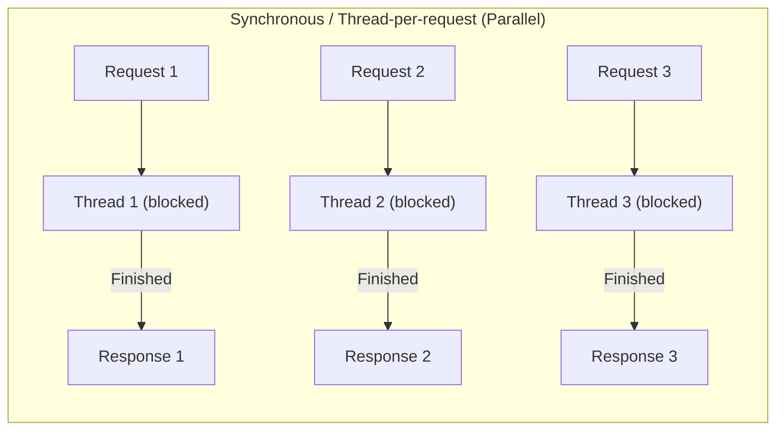
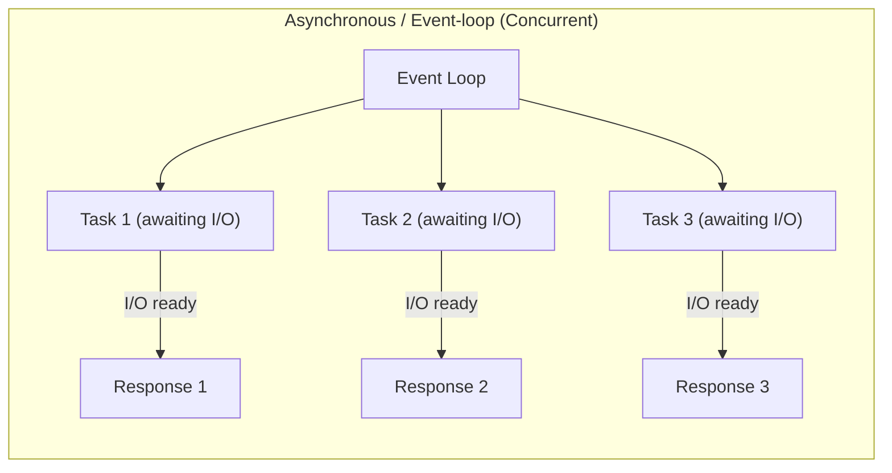

# Asynchronous programming

## History

### Concurrency

* **Definition:** Managing **multiple tasks at once**, but not necessarily executing them simultaneously.
* **Key idea:** Structuring a program so tasks can **progress independently**.
* **Analogy:** A **single juggler** tossing several balls—one at a time, but all kept in the air.
* **CPU:** Works on one task at a time; tasks **switch context** quickly.
* **Use case:** I/O-bound workloads, web servers, high-latency operations.

---

### Parallelism

* **Definition:** Doing **multiple things simultaneously**.
* **Key idea:** Tasks **actually run at the same time** on multiple processors or cores.
* **Analogy:** **Team of chefs** preparing different dishes simultaneously.
* **CPU:** Multiple cores execute tasks concurrently.
* **Use case:** CPU-bound tasks, heavy computation, simulations, scientific calculations.

---

## Quick Comparison

| Feature         | Concurrency      | Parallelism           |
| --------------- | ---------------- | --------------------- |
| Execution       | Interleaved      | Simultaneous          |
| Number of cores | 1+               | Multiple required     |
| Best for        | I/O-bound tasks  | CPU-bound tasks       |
| Example         | Async web server | Matrix multiplication |

---

### Early Software: Manual Concurrency

* In early systems, **the programmer managed everything**:

  * Scheduling
  * Coordination of tasks
* **All decisions were manual** → complex and error-prone code
* Example: Batch systems and early operating systems

> The concept of “automatic concurrency” did not exist yet.

---

### The Emergence of the **Scheduler**

* Introduction of **OS schedulers**:

  * Automatically **switch between processes**
  * **CPU time-sharing**: one process uses CPU, then another
* Benefits:

  * Simplifies code
  * Enables multitasking without manual management

---

### Concurrency with Threads & High Throughput

* In **I/O-bound, high-throughput systems**:

  * Each request → **dedicated thread**
  * Scheduler switches between all threads
* Problems:

  * **Thousands of waiting threads** saturate memory and CPU
  * Increased latency → degraded performance

---

### Return to Cooperative Concurrency

* Modern solution: **cooperative concurrency / async**

  * Tasks or coroutines **voluntarily yield CPU** during I/O
  * No dedicated thread per request
* Benefits:

  * Handles **thousands of tasks** on few threads
  * **Reduces memory and context-switch overhead**
  * Perfect for **web servers and I/O-bound services**

---

## Synchronous Model (Blocking)

* **Model:** **Inherently parallel**

  * Each request spawns a **dedicated thread**.
  * The thread **blocks** until the operation completes (e.g., file read, DB query).
* **Implications:**

  * Multiple threads can run in parallel on multiple cores.
  * High memory and CPU overhead if there are many concurrent requests.
  * Thread-per-request model can **saturate resources** in I/O-bound systems.
* **Example:** Reading a file synchronously — the program **waits** until the read finishes.



---

## Asynchronous Model (Non-blocking)

* **Model:** **Inherently concurrent**

  * A task **does not block**; it **yields control** while waiting for I/O.
  * Other tasks can **progress on the same thread**.
* **Implications:**

  * Efficient handling of **thousands of simultaneous tasks** with minimal threads.
  * Reduces memory and context-switch overhead.
  * Ideal for **I/O-bound workloads** or high-latency operations (network, disk, DB).
* **Example:** Using `async/await` in Python — multiple file reads **overlap**, no threads are blocked.



---

## Asyncio library

Python's asyncio library provides a framework for writing concurrent code using the asynchronous paradigm. The `async` and `await` keywords are the core components of this framework.

Together, `async` and `await` enable a style of programming called **cooperative multitasking**. The coroutines voluntarily yield control to each other, allowing the program to perform multiple operations concurrently on a single thread without blocking. 

### `async`

* The `async` keyword is used to **define an asynchronous function**, also called a **coroutine** in Python.
* Calling an `async` function **does not immediately run it**. Instead, it returns a **coroutine object**, which represents the work that can be scheduled on an event loop.

**Example:**

```python
import asyncio

async def say_hello():
    print("Hello")
```

* If you call `say_hello()` directly, it **does not execute yet**; it returns a coroutine object.
* * To actually run it, you need to **schedule it on an event loop**, e.g., with `asyncio.run()`.

```python
coro = say_hello()
print(coro)
# <coroutine object say_hello at 0x...>
```

---

### `await`

* The `await` keyword **pauses the coroutine until another async operation finishes**.
* Unlike `time.sleep()` (blocking), `await` is **non-blocking**: it tells the event loop, “I’m waiting, you can run other tasks in the meantime.”

**Example:**

```python
import asyncio

async def wait_and_print():
    print("Start waiting")
    await asyncio.sleep(2)  # Non-blocking sleep
    print("Done waiting")

asyncio.run(wait_and_print())
```

* Output:

```
Start waiting
(wait 2 seconds without blocking)
Done waiting
```

* During the `await asyncio.sleep(2)`, the event loop could run **other coroutines**.

---

### How `async` and `await` work together

**Example with multiple tasks:**

```python
import asyncio

async def task(name, duration):
    print(f"{name} started")
    await asyncio.sleep(duration)  # Non-blocking
    print(f"{name} finished")

async def main():
    await asyncio.gather(
        task("A", 2),
        task("B", 3)
    )

asyncio.run(main())
```

* `task("A")` and `task("B")` start almost simultaneously.
* Total runtime ≈ 3 seconds, not 5, because `await` allows overlapping execution.

### Event loop

The **event loop** is a fundamental component of asynchronous programming in Python. **It's essentially a scheduler** for your asynchronous tasks. The event loop continuously monitors coroutines for completion and dispatches new tasks as soon as the CPU becomes available.

Here's how it works:

1. A task starts, and if it encounters an I/O-bound operation (e.g., waiting for a network request to complete), it awaits the result.
2. When a task awaits, it temporarily yields control back to the event loop.
3. The event loop then looks for other tasks that are ready to run and dispatches one of them.
4. Once the original I/O operation is complete, the event loop is notified. It then puts the original task back on the schedule to continue its execution from where it left off.

This continuous cycle allows the program to remain responsive and perform multiple operations concurrently on a single thread. 


## HTTP Messages handling approaches

### Synchronous Handler with Threads
**Definition:** Each request is handled in a **dedicated thread** and blocks until the operation completes.

- **Blocking I/O:** CPU waits while DB or HTTP call executes  
- **Thread-per-request model:** Memory usage grows linearly with concurrent requests  
- **Limited scalability:** Only as many simultaneous requests as available threads   
- **High latency under load:** Slow downstream calls block processing

```python
from fastapi import FastAPI
import time

app = FastAPI()

@app.get("/items-sync")
def get_items_sync():
    time.sleep(1)  ## blocks thread
    return ["Item1","Item2","Item3"]
```

---

### Asynchronous Handler
**Definition:** Tasks **yield control while awaiting I/O**; the **event loop** schedules pending operations.

- Single thread handles thousands of connections efficiently  
- Better CPU utilization   
- Reduces latency spikes under load

```python
from fastapi import FastAPI
import asyncio

app = FastAPI()

@app.get("/items-async")
async def get_items_async():
    await asyncio.sleep(1)  ## non-blocking
    return ["Item1","Item2","Item3"]
```

## References
- FastAPI docs: https://fastapi.tiangolo.com  
- Python asyncio: https://docs.python.org/3/library/asyncio.html  
- Spring WebFlux: https://docs.spring.io/spring-framework/docs/current/reference/html/web-reactive.html  
- Quarkus reactive guide: https://quarkus.io/guides/reactive  
- Reactive Streams spec: https://www.reactive-streams.org/
