# Introduction to MLOps

## MLOps

### Issues of Production Models
* ML models are **not set and forget machines**.
* Models are trained on **specific historical datasets**.
* Real-world data is **dynamic** — new products, customer behavior, and market conditions evolve.

### Key Actions for Maintenance
1. **Retrain models regularly** on updated data.
2. Design a **model update and retraining automation**.
3. Implement **model monitoring** to track performance between updates.


### Definition
**MLOps (Machine Learning Operations) extends DevOps principles to address the unique workflows and challenges associated with machine**. Specifically, it is tailored to manage the complexities of integrating ML models into production environments.

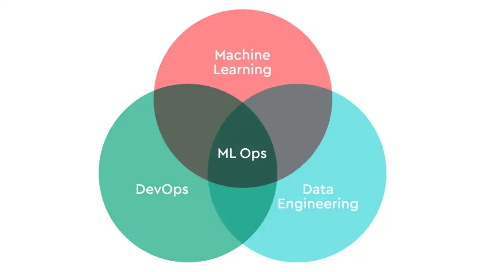

MLOps is a set of practices that combines machine learning (ML) model development with operations (Ops), aiming to **automate and streamline the entire lifecycle of ML models**. This lifecycle includes stages such as:
* data preparation
* model development
* model deployment
* model monitoring

MLOps helps ensure that **models remain effective, scalable, and adaptable to changing production environment conditions**.

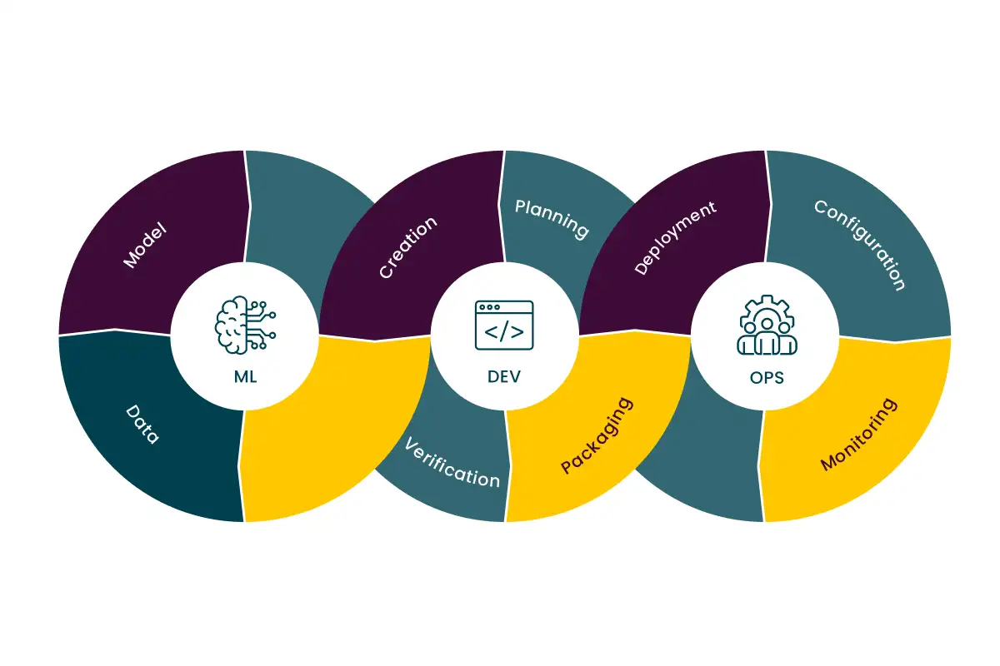


### Benefits

* **1. Scalability:**

  * Ability to deploy and manage machine learning models at large-organization scale, supporting multiple environments and large datasets.

* **2. Automation:**

  * Automating workflows for model training, testing, deployment, and monitoring to increase deployment frequency.

* **3. Accountability:**

  * Keeping track of changes in code, models, data, and experiments to ensure accountability.

* **4. Continuous Integration/Continuous Deployment (CI/CD):**

  * Implementing automated pipelines to deploy new versions of models and code seamlessly without downtime.

* **5. Model Monitoring and Management:**

  * Ongoing tracking of model performance and detection of issues like **concept drift** or **data drift**, ensuring models stay effective over time.
  
* **6. Reproducibility:**

  * Ensuring that models can be reliably retrained and tested with the same parameters and data, fostering consistency across teams.

## MLOps Implementation

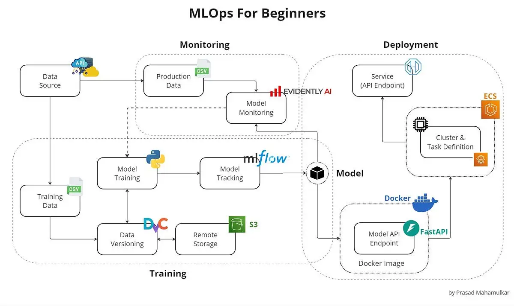

1. **Training Data**: The dataset used to train machine learning models. It should be curated and representative of the problem domain.

2. **Data Versioning**: Training data must be versioned to ensure reproducibility and traceability across model iterations.

3. **Model Training**: The process of building the machine learning model using the training data. This should be integrated with CI/CD pipelines to align with application development workflows.

4. **Model Tracking**: Tools and practices to track experiments, including hyperparameters, training metrics, and outcomes, enabling comparison and reproducibility.

5. **Model Artifact**: The trained model, typically stored in a model registry or object store, ready for deployment or further evaluation.

6. **Model Monitoring**: In-production monitoring to detect data drift, concept drift, or performance degradation based on real-time or batch inference data.

7. **Production Data**: New data collected during model operation, often including ground truth labels, used for monitoring and retraining purposes.


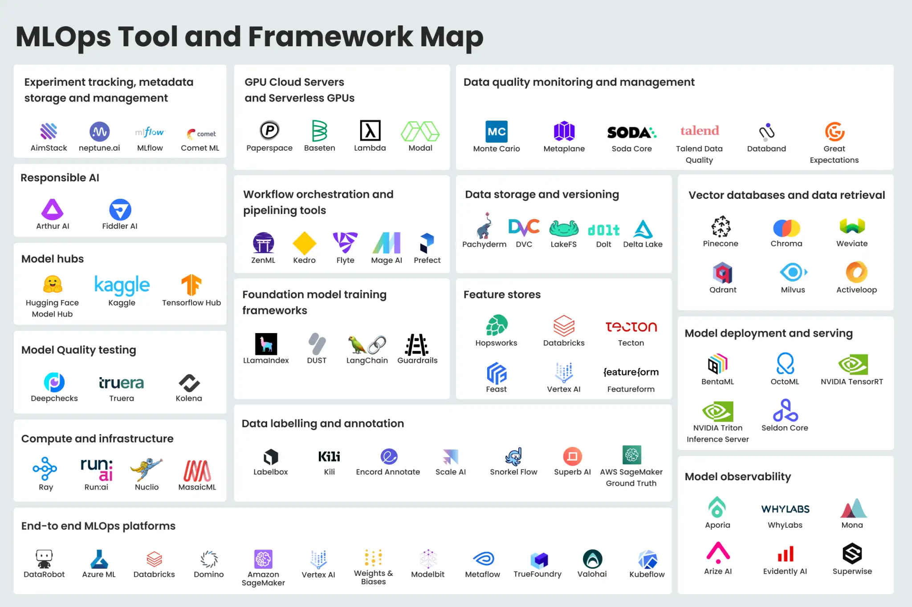

### Data Versioning

Datasets continuously evolve:

* new samples
* corrections
* updated features
* preprocessing changes

Without versioning:

* experiments are not reproducible
* debugging becomes difficult
* collaboration is error-prone

**A data versioning system should support:**

* dataset tracking
* reproducibility
* rollback
* collaboration
* lineage tracking
* experiment comparison

```text
Raw Data
   ↓
Cleaning
   ↓
Feature Engineering
   ↓
Training Dataset v3
   ↓
Model v12
```

#### Tool Comparison

| Tool       | Main Focus                  | Best For             |
| ---------- | --------------------------- | -------------------- |
| DVC        | ML datasets & pipelines     | ML experimentation   |
| LakeFS     | Git-like data lakes         | Large object storage |
| Delta Lake | Versioned analytical tables | Big data analytics   |

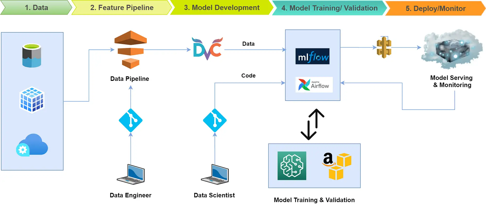

---

### Feature Store

ML systems require the same features during:

* training
* validation
* inference

Without a feature store:

* duplicated feature engineering logic
* training/serving skew
* inconsistent predictions
* difficult feature reuse

**A feature store should support:**

* centralized feature management
* feature reuse
* low-latency serving
* consistency between training and inference
* feature lineage
* monitoring and governance

```text
Raw Data Sources
        ↓
Feature Pipelines
        ↓
Feature Store
   ↙           ↘
Offline Store   Online Store
   ↓                ↓
Training         Real-Time Inference
```


| Tool      | Main Focus                    | Best For              |
| --------- | ----------------------------- | --------------------- |
| Feast     | Open-source feature serving   | MLOps pipelines       |
| Tecton    | Enterprise real-time features | Production AI         |
| Hopsworks | Integrated ML platform        | End-to-end ML systems |

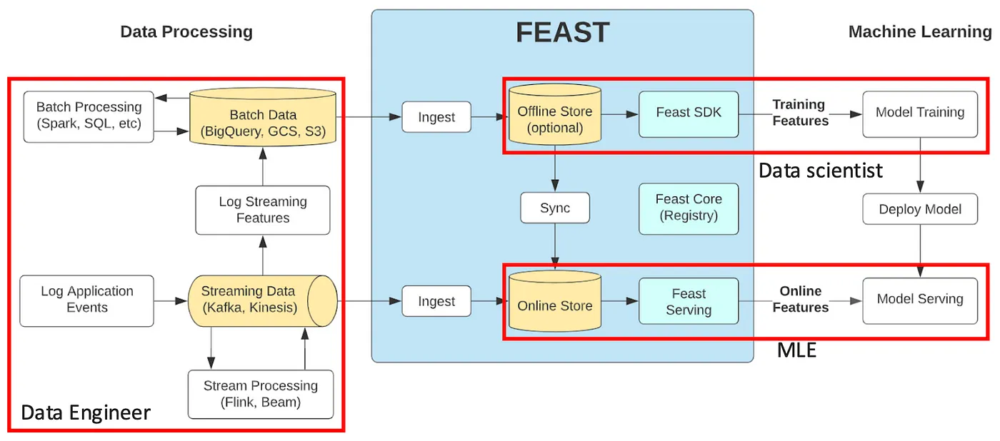

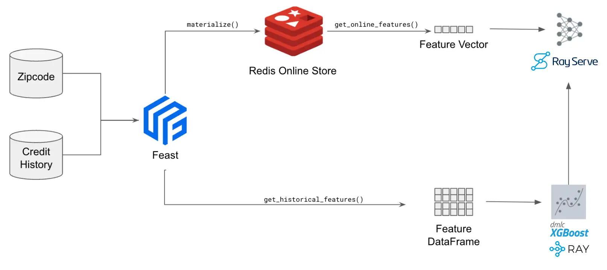

### Experiment Tracking

Machine learning development involves many experiments:

* different models
* hyperparameter tuning
* dataset variations
* feature engineering changes
* architecture modifications

Without experiment tracking:

* results become difficult to reproduce
* comparing runs is error-prone
* hyperparameters are easily lost
* collaboration becomes difficult
* model selection is unreliable

**An experiment tracking system should support:**

* run logging
* metric visualization
* hyperparameter tracking
* artifact storage
* experiment comparison
* reproducibility
* collaboration
* model lineage

```text
Dataset + Code + Parameters
              ↓
        Training Run
              ↓
     Experiment Tracking
     ↙        ↓        ↘
 Metrics   Artifacts   Metadata
     ↓         ↓          ↓
Comparison  Models     Reproducibility
```

| Tool             | Main Focus                      | Best For                      |
| ---------------- | ------------------------------- | ----------------------------- |
| MLflow           | Open-source ML lifecycle        | General MLOps workflows       |
| Weights & Biases | Experiment visualization        | Deep learning experimentation |
| Neptune.ai       | Metadata and experiment logging | Collaborative ML teams        |

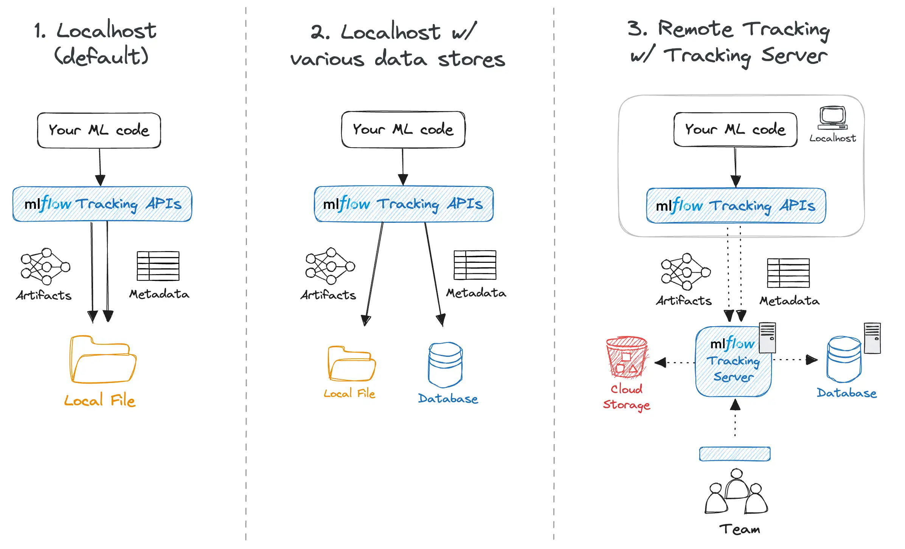
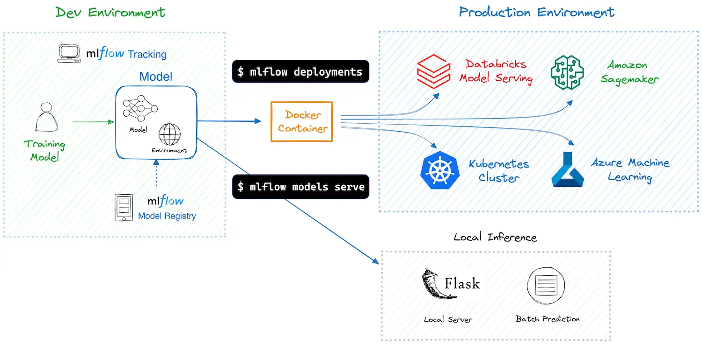

### Automated Pipelines

ML systems involve multiple repetitive stages:

* data ingestion
* preprocessing
* feature engineering
* model training
* evaluation
* deployment

Without automated pipelines:

* workflows become manual and error-prone
* deployments are inconsistent
* reproducibility is difficult
* scaling ML processes becomes complex
* debugging pipeline failures is harder

**An automated ML pipeline system should support:**

* workflow orchestration
* task scheduling
* dependency management
* reproducibility
* pipeline monitoring

```text
Raw Data
    ↓
Data Processing
    ↓
Feature Engineering
    ↓
Model Training
    ↓
Evaluation
    ↓
Deployment
    ↓
Monitoring
```

| Tool               | Main Focus                     | Best For                      |
| ------------------ | ------------------------------ | ----------------------------- |
| Kedro              | Reproducible data pipelines    | Structured ML projects        |
| ZenML              | MLOps pipeline orchestration   | Portable ML workflows         |
| Airflow            | General workflow scheduling    | Enterprise data orchestration |
| Kubeflow Pipelines | Kubernetes-native ML pipelines | Cloud-native ML platforms     |

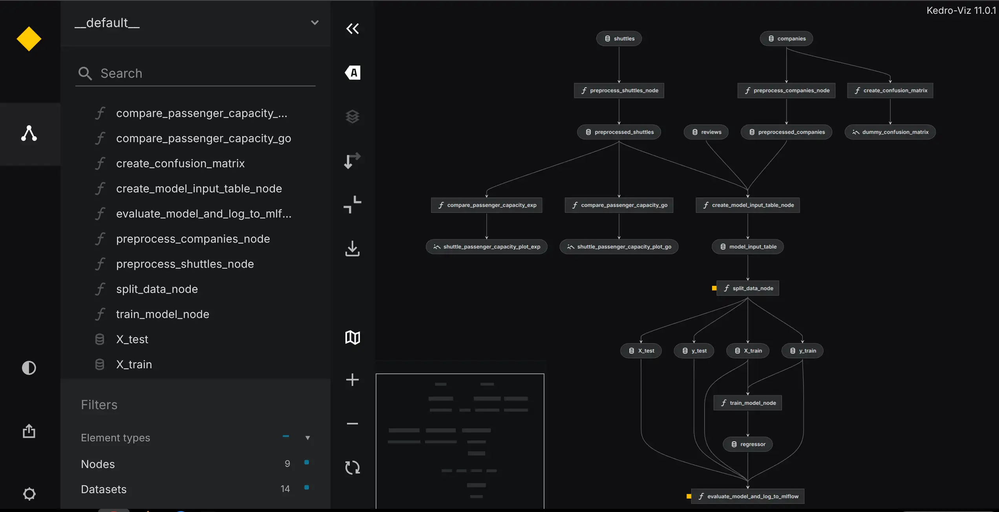

### Model Registry (Object Store)

ML systems continuously produce new model versions:

* retrained models
* fine-tuned models
* experimental variants
* production-ready releases
* rollback candidates

Without a model registry:

* model versions become difficult to track
* deployments are error-prone
* rollback is complicated
* metadata is fragmented
* collaboration becomes difficult

**A model registry system should support:**

* model versioning
* metadata management
* lifecycle management
* artifact storage
* deployment integration
* access control
* reproducibility
* rollback support

```text
Training Pipeline
        ↓
Generated Models
        ↓
Model Registry / Object Store
   ↙            ↓             ↘
Versioning   Metadata      Artifacts
   ↓             ↓             ↓
Deployment   Governance    Rollback
```

| Tool                  | Main Focus                     | Best For                        |
| --------------------- | ------------------------------ | ------------------------------- |
| MLflow Model Registry | ML model lifecycle management  | End-to-end MLOps workflows      |
| MinIO                 | S3-compatible object storage   | Scalable model artifact storage |
| Hugging Face Hub      | Model sharing and distribution | AI model collaboration          |

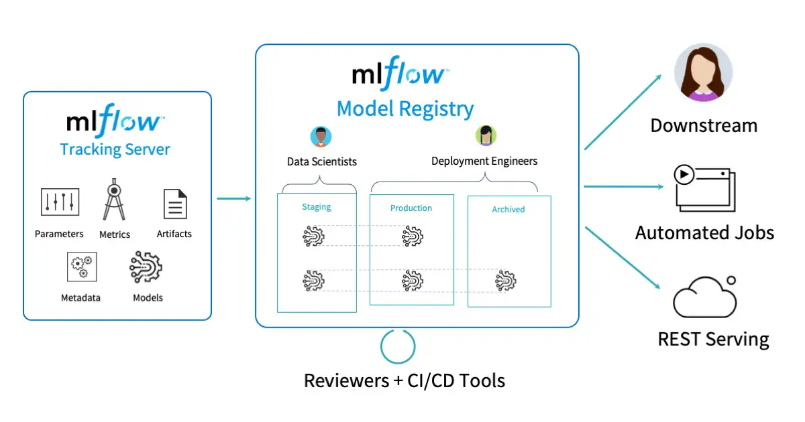

### Model Serving

Once a model is trained, it must be exposed for inference in production environments:

* real-time predictions via APIs
* batch inference jobs
* edge or embedded deployment
* scalable inference under load
* integration with applications and services

Without a model serving layer:

* models remain hard to deploy
* inference logic is duplicated across services
* scaling predictions becomes inconsistent
* latency is unpredictable
* updates require manual redeployment
* monitoring predictions is difficult

**A model serving system should support:**

* low-latency inference
* scalable deployment (horizontal scaling)
* model versioning and rollout strategies
* A/B testing and canary deployments
* REST/gRPC APIs
* batch + real-time inference
* observability (latency, errors, drift signals)
* hardware acceleration (CPU/GPU support)

```text id="serving_pipeline"
Model Registry
      ↓
Packaging / Containerization
      ↓
Model Serving Layer
   ↙        ↓         ↘
 REST API   gRPC   Batch Jobs
   ↓         ↓          ↓
Applications  Services  Data Pipelines
      ↓
Monitoring & Feedback Loop
```

| Tool               | Main Focus                         | Best For                       |
| ------------------ | ---------------------------------- | ------------------------------ |
| BentoML            | Python-first model packaging       | Fast ML API deployment         |
| Seldon Core        | Kubernetes-native model deployment | Scalable production ML systems |
| TensorFlow Serving | TensorFlow model inference         | TF-based production workloads  |
| TorchServe         | PyTorch model serving              | PyTorch inference at scale     |

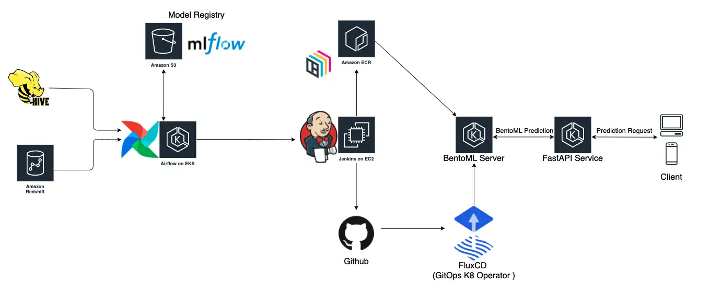

### Model Monitoring

Once models are deployed, their behavior can change over time due to:

* data distribution shifts
* seasonality effects
* user behavior changes
* upstream pipeline modifications
* feedback loops in production systems

Without model monitoring:

* performance degradation goes unnoticed
* data drift silently breaks predictions
* debugging production issues becomes slow
* retraining decisions are delayed or incorrect
* compliance and auditability are weak

**A model monitoring system should support:**

* performance tracking (accuracy, precision, recall, etc.)
* data drift detection
* concept drift detection
* anomaly detection in inputs/outputs
* real-time and batch monitoring
* alerting and notification systems
* explainability tracking
* model and data lineage correlation

```text id="model_monitoring"
Live Data Streams
        ↓
   Model Inference
        ↓
 Predictions + Logs
        ↓
 Monitoring Layer
   ↙      ↓       ↘
Drift   Metrics   Anomalies
Detection Tracking Detection
   ↓        ↓        ↓
Alerts   Dashboards  Feedback
        ↓
   Retraining Loop
```

| Tool      | Main Focus                | Best For                    |
| --------- | ------------------------- | --------------------------- |
| Evidently | Open-source ML monitoring | Drift detection & reports   |
| Arize AI  | ML observability platform | Production model monitoring |
| Fiddler   | Model explainability & QA | Enterprise ML governance    |

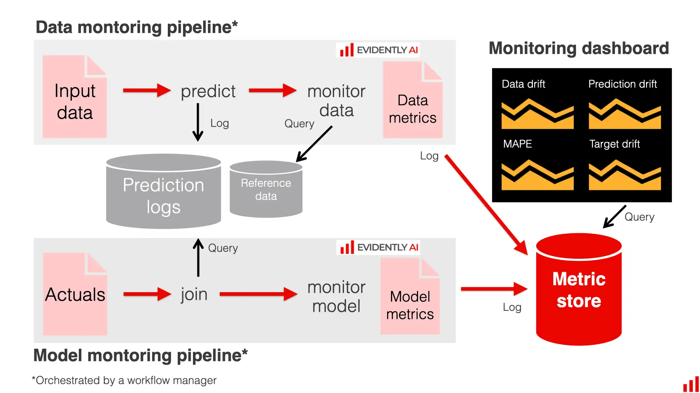

#### Training-Serving Skew

Happens when there’s a **mismatch** between the data used to train the model and the data seen in production.


#### Data Drift

**Definition:** Data drift refers to a change in the statistical properties and characteristics of the input data over time. It occurs when a **ML model in production encounters data that deviates from the data it was trained on**.

**Scenario:** Imagine a retail chain that uses machine learning to predict how many products to stock in each of their stores. The model was trained using historical sales data, mostly from physical store sales.


**Problem:** The model, trained on in-store data, didn’t perform well for online sales because the training data lacked sufficient online sales information.


#### Concept Drift

* Refers to changes in the relationship between input features and model outputs (i.e., the target variable).
* Example: A new competitor’s discounts change consumer behavior, leading to a decrease in average sales in physical stores.

**Difference:**

* **Data drift**: Shifts in input feature distributions (e.g., sales data changes due to shifting shopping preferences).
* **Concept drift**: Shifts in the relationship between inputs and outputs (e.g., new market conditions lead to a change in consumer behavior).

**Similarity:**

Both can cause model quality degradation and often occur together. Monitoring data drift can be a symptom of concept drift.


#### Prediction Drift

* Refers to changes in the **model outputs** (predictions).
* Example: A fraud detection model starts predicting fraud more frequently, or a pricing model outputs significantly lower prices.

Both **data drift** and **prediction drift** are important techniques for monitoring models in production. They can signal a change in the model’s environment or data, and both can help track model performance in the absence of ground truth.


#### Feedback Delay

* **Definition**: Time gap between model prediction and receiving the true outcome.
* **Challenge**: Hinders **real-time monitoring** of model performance.

**Real-World Examples**

* **Recommender systems**: Did the user click or buy?
* **Fraud detection**: Was the transaction actually fraudulent?

Feedback can take **seconds... or months** to arrive.


#### Data Quality

* Refer to **corrupted**, **incomplete**, or **incorrect** data.
* Often caused by bugs in data pipelines or manual errors.
* Examples:

  * Missing values
  * Unexpected nulls
  * Incorrect feature scales
  * Schema mismatches


#### How to Detect Drifts

**Summary Statistics**

* Track shifts in **mean, median, variance**, quantiles, etc.
* Monitor **min-max compliance** to catch unexpected values.
* Simple but can be noisy with many features.


**Statistical Tests**

* Use tests like **Kolmogorov-Smirnov** (numerical) and **Chi-square** (categorical).
* Result: **p-value** indicating if changes are statistically significant.
* May detect minor, insignificant shifts in large datasets.


**Distance Metrics**

* Quantify how far distributions diverge using:

  * **Wasserstein Distance**
  * **Jensen-Shannon Divergence**
  * **Population Stability Index (PSI)**
* Use as a continuous “drift score.”


**Rule-Based Checks**

-   The share of the predicted "fraud" category is over 10%.
-   A new categorical value appears in a feature "location" or "product type."
-   More than 10% of the feature "salary" values are out of the defined min-max range.

While such checks do not directly measure drift, they can serve as good alerting heuristics to notify about likely meaningful changes to investigate further.


## MLOps Maturity

### MLOps Level 0

* **Manual Model Training**: Data scientists train models manually on local machines or scripts without automated workflows. Training and evaluation are driven by notebooks or loosely organized Python scripts, often lacking proper software engineering practices.

* **No Versioning**: Models, data, and code are often not versioned properly, making it difficult to reproduce results or track changes.

* **No Continuous Integration or Deployment (CI/CD)**: There is no automation; model deployment (if any) is done manually, often by copying files or manually editing APIs.

* **Inconsistent Environments**: Models may work in development but fail in production due to inconsistent libraries, dependencies, or hardware setups.

* **Lack of Monitoring**: Once deployed, models are rarely monitored. No logging, alerts, or performance tracking in place.

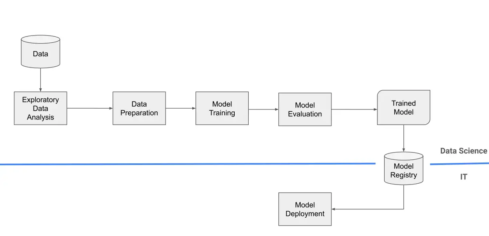

### MLOps Level 1

* **Model Monitoring in Production**: Tools or scripts monitor deployed models for issues like data drift, prediction errors, and performance degradation.

* **Scheduled Model Retraining**: Retraining is done more frequently than Level 0, typically on a fixed schedule (e.g., weekly or monthly), not dynamically triggered.

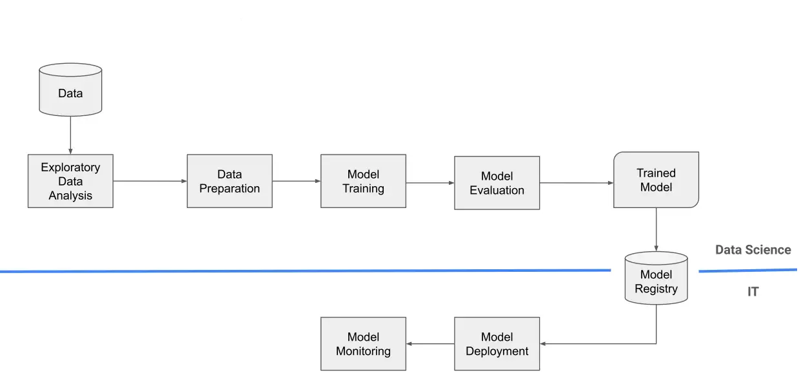

### MLOps Level 2

* **Data and Model Versioning**: All datasets, models, and configurations are versioned for full reproducibility (e.g., using tools like DVC or MLflow).

* **Modular Pipelines**: The ML lifecycle is split into reusable components (training, evaluation, deployment) using tools like Kubeflow, Airflow, or TFX. Docker/Kubernetes ensure consistent behavior across dev, test, and prod environments.

* **Monitoring and Alerting**: Real-time monitoring of model performance, prediction drift, and data quality; alerts are triggered on anomalies.

* **Scalability**: Pipelines and inference services scale horizontally using distributed training or GPU-backed clusters.

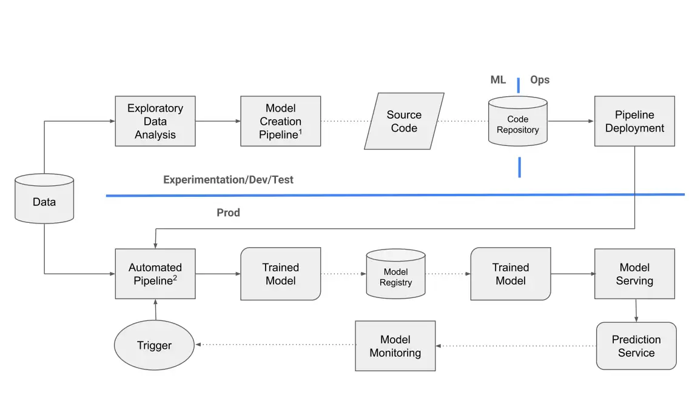


## Resources
